# Pocket-Ekken
## 目的
このレポジトリは、LaTeXやVSCodeなどの環境構築なしで、スマートフォンを含む環境で簡単に基礎科学実験Aで使用できる実験レポートを制作できるようにすることを目的としている。
## 背景
基礎科学実験Aで実験レポートを作成する際、VSCodeと$\LaTeX$を使用するのが一般的になっている。
しかし、これらの環境を用意するのは面倒であるし、使い勝手もよいといえない。具体的に例を挙げると

- ローカルでのLaTeXの環境構築には時間がかかり、ある程度のPCスキルが必要である。
- ローカルでの執筆を前提とすると、バックアップに不安がある。
- オンラインエディタを使用する場合、安定したインターネット接続が必要で、サービスが常に利用可能である保証がない。
- 基本的に.texを編集するのはコードエディタであり、長文を書くのに向いていない。
- いずれの環境でもスマートフォンでレポートを確認したり編集したりするのは難しい。

などの問題がある。
そこで、本レポジトリでは、マークダウンエディタ[Obsidian](https://obsidian.md/)を用いて、スマートフォンを含む様々な環境で簡単に実験レポートを作成できるようにする。

# 方針
背景の問題を解決するために、以下の方針を採用した。

| 方針 | 説明 |
| --- | --- |
| Obsidian の Vault を配布 | ユーザーがローカルで複雑な環境構築を行わずに、すぐにレポートの編集を始められるようにする。 |
| スマートフォン向け Obsidian アプリの利用 | スマートフォンでの編集・確認を可能にし、いつでもどこでも執筆・確認ができる利便性を提供する。 |
| Markdown → .tex 変換スクリプトを提供 | 執筆は Markdown で行い、.tex の直接編集を不要にすることで作業負荷を軽減する。 |
| GitHub 同期と GitHub Actions による PDF 自動生成 | バックアップと自動ビルドを実現し、編集内容を自動で PDF にして配布できるようにする。 |

構成のイメージは以下の図のようになる。

# 実行方法
## GitHub側の操作
はじめに、[GitHubのサイト](https://github.com/)にアクセスし、アカウントを作成した。方法は問わないが、
以下の図のようにメニューから「Sign up」を選択するとGoogleアカウントやApple IDに紐づけたアカウントを作成できた。

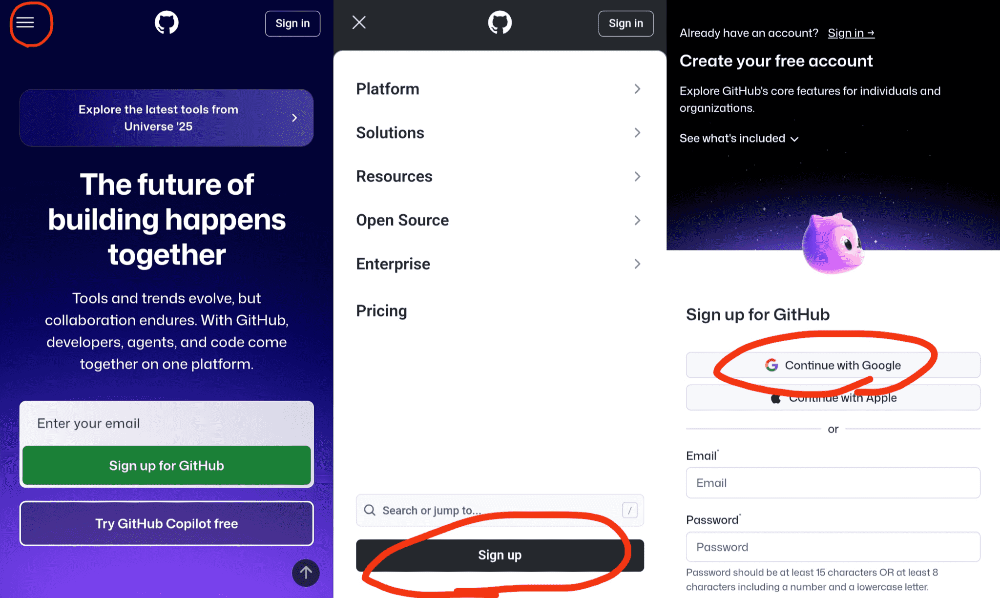

アカウントが作成できたら、[Pocket-Ekkenのレポジトリ](https://github.com/shibadogcap/Pocket-Ekken)にアクセスし、レポジトリをフォークした。
以下の図のようにボタンを押して、レポジトリの名前を決めたら緑色の「Create fork」ボタンを押すとフォークできた。

フォークが完了したら、自分のデータが公開されないように、レポジトリを非公開に設定した。これには二つの手順を踏んだ。
まずは以下の図のように、レポジトリの設定を開き、下の方にある「Leave fork network」を選択した。警告が表示されるが無視し、指定された文字列を入力して「Leave fork network」を押した。

続いて、ページを再読み込みし、レポジトリの設定画面で「Change visibility」を選択し、「Change to private」を押してレポジトリを非公開にした。

続けて、自動ビルドのために、レポジトリでGitHub Actionsを有効にした。以下の図のように、レポジトリの「Actions」タブを選択し、「Enable Actions on this repository」を押した。

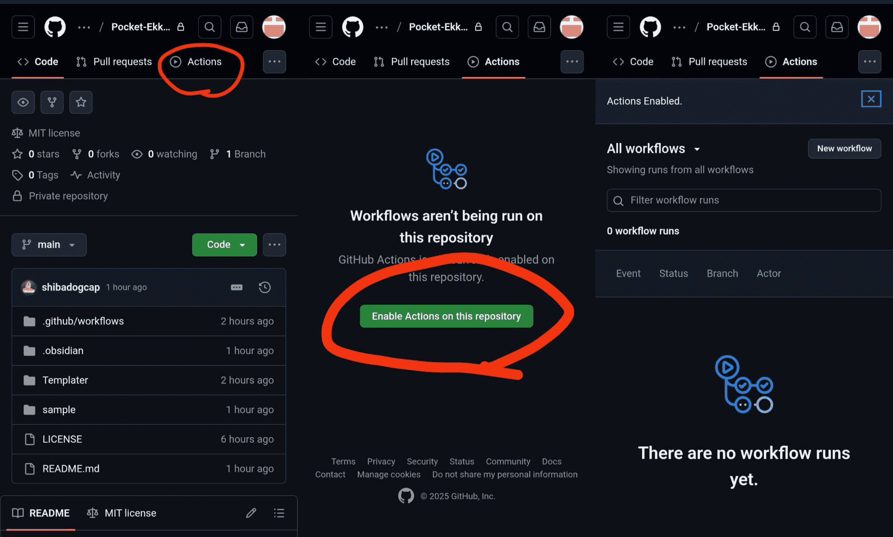

最後に、Obsidianで使用するために、パーソナルアクセストークンを取得した。以下の図のように、プロフィールアイコンを押して「Settings」を選択し、「Developer settings」を選択した。

続いて、「Personal access tokens」を選択し、「Tokens (classic)」を選択した。次に、「Generate new token」を押し、「Generate new token (classic)」を選択した。

トークンの名前を入力し、repoの権限にチェックを入れたら、「Generate token」を押してトークンを生成した。このとき生成されたトークンは後で使用するが、一度しか表示されないのでコピーして保存した。

## Obsidian側の操作

まずは、スマートフォンにObsidianアプリをインストールした。iPhoneの場合はApp Store、Androidの場合はGoogle Playからインストールできる。
インストールが完了したら、Obsidianアプリを起動し、「Create a new vault」→「Continue without sync」の順に選択した。

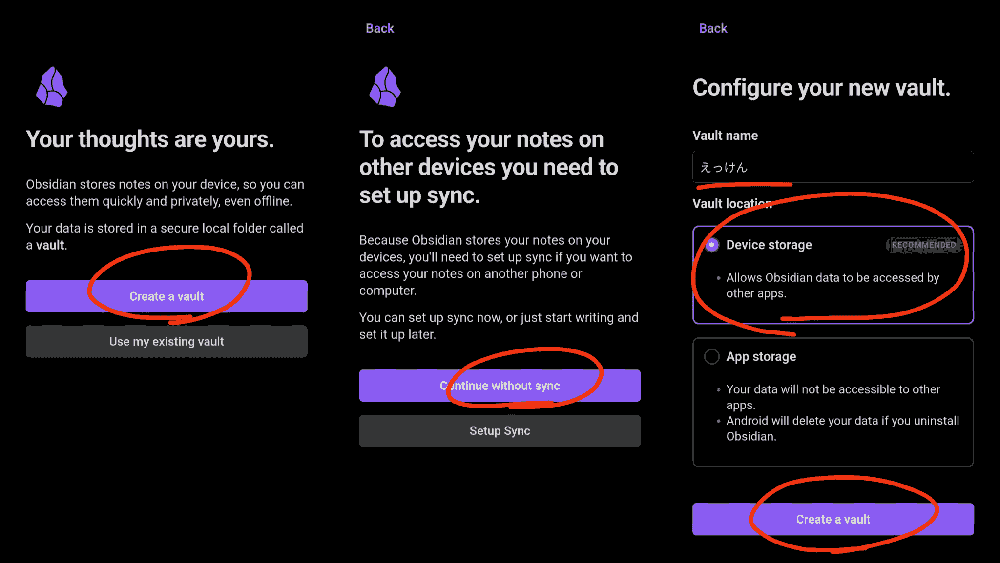

続けて、vaultに適当な名前を付け、場所にはDevice Storageを選択して「Create a vault」を押した。
次に、Gitを扱うためのプラグインを導入した。以下の図のように、左上のアイコンからサイドバーを開き、歯車アイコンを押して設定画面を開いた。続いて、「Community plugins」を選択し、「Turn on community plugins」を押した。

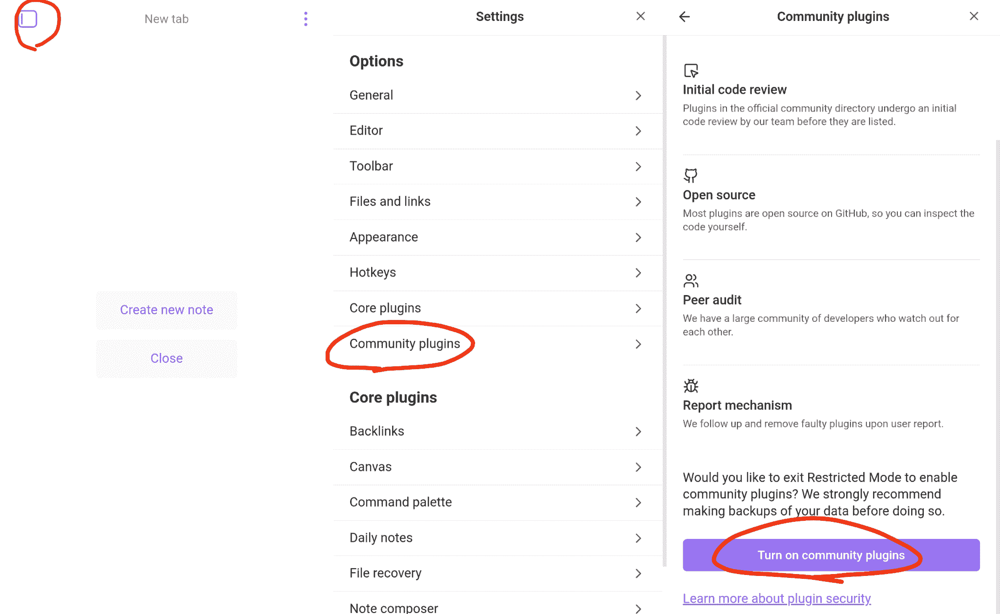

すると、「Browse」ボタンが表示された。ここで「git」と検索、選択したら「Install」、続いて「Enable」を押してプラグインを有効化した。

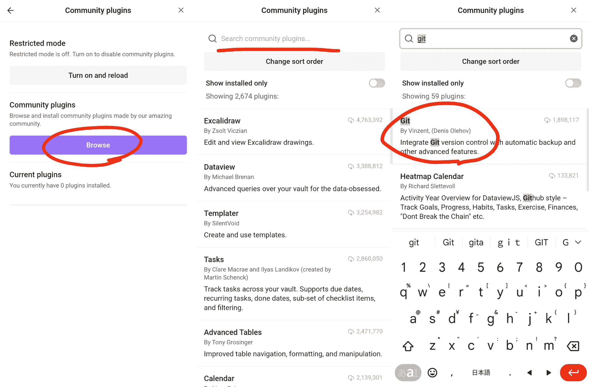

プラグインが有効化されたら、「Options」を押してプラグインの設定画面を開いた。

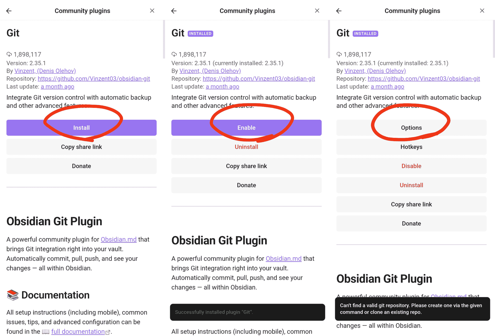

以下の図のように下の方にUsernameやPersonal Access Tokenを入力する欄があるので、GitHubのユーザ名と先ほど取得したパーソナルアクセストークンを入力した。

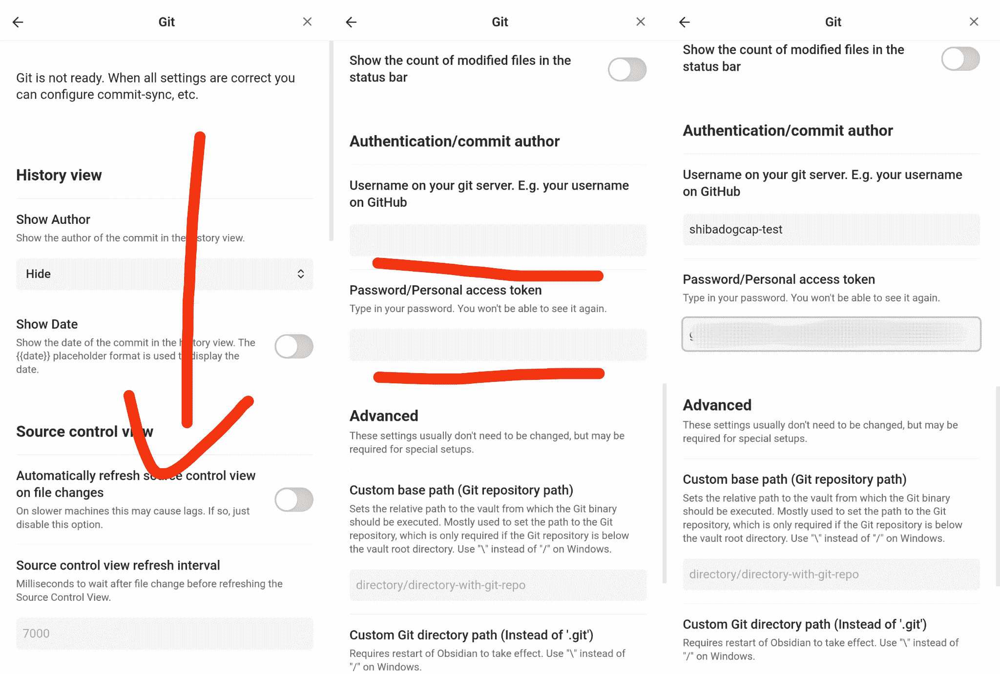

トークンを入力したら、ObsidianのNew Tabの画面に戻り、下にスワイプしてCommand Palletteから「Git: Clone an existing remote repo」を選択した。
そのあとは、以下の図のように、レポジトリのURL→空欄→YES→DELETE ALL YOUR LOCAL CONFIG AND PLUGINS→空欄の順に選択した。

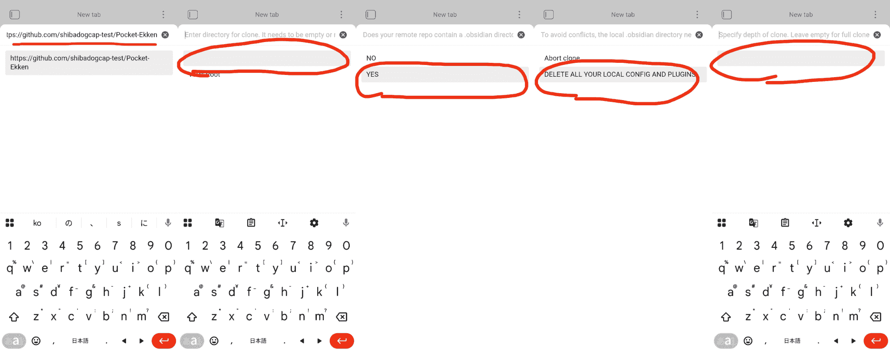

しばらく待つと、「Please restart Obsidian」という表示があるので、したがって再起動した。
再起動し、左サイドバーを確認すると、README.mdなどのファイルが表示されていた。

最後に、Gitプラグインの認証情報を再入力した。

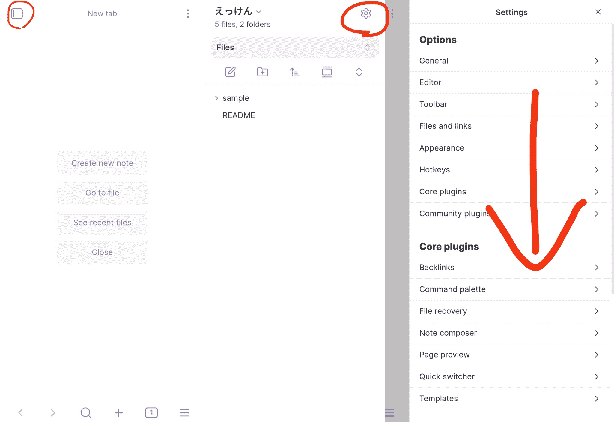

先ほどと同様にプラグインの設定画面に移動すると、認証情報のほかにも、コミット時の名前とメールアドレスを入力する欄が出現しているので、それぞれ適当な名前とメールアドレスを入力した。

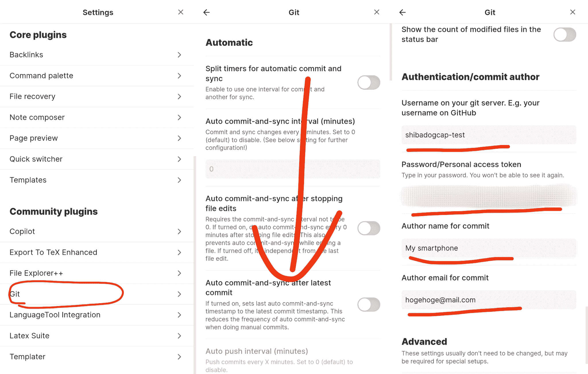

## 編集の操作

ここでは、README.mdをベースにレポートの制作を実験した。
まずは、左サイドバーからREADME.mdを選択し、編集画面を開いた。適当に文章を編集したら、すでに古い.texがないことを確認し、上からスワイプしてCommand Palletteを開き、「Export To TeX Enhanced: Export To TeX」を選択した。

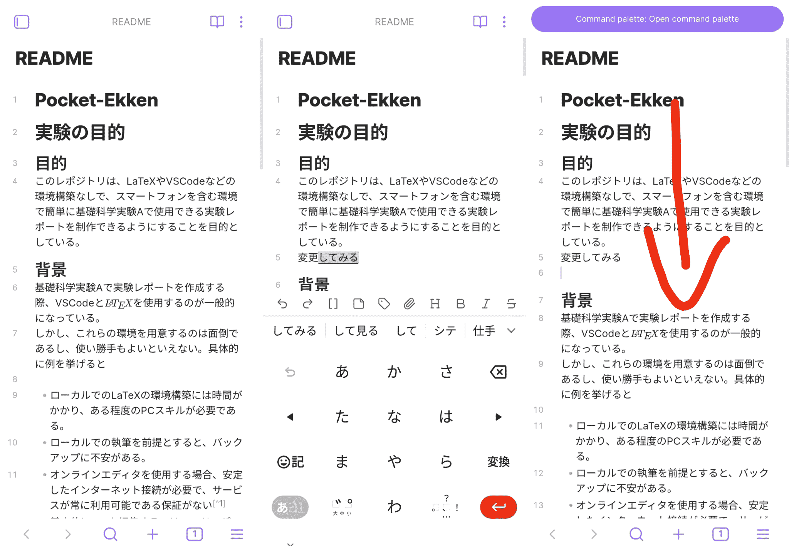

すると、タイトルなどの情報を入力する画面が表示されるので、適当に入力して「OK」を押した。続いて画像や表のタイトルを入力する画面が表示されるので、適当に入力して「OK」を押した。

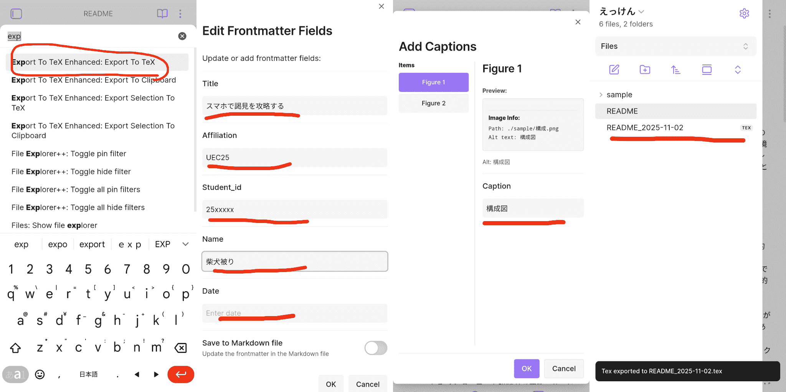

しばらく待つと、.texファイルが生成され、同じディレクトリに保存された。

.texができていることを確認したら、上からスワイプしてCommand Palletteを開き、「Git: Commit-and-sync」を選択した。

しばらく待つと、Pushed xx files to remoteという表示とともに、GitHub側に変更が反映されていることが確認できた。

同期が完了して2分ほどすると、GitHub Actionsによって、レポジトリにリリースが作成されていた。
これをダウンロードして確認すると、編集が反映されたPDFファイルができていることが確認できた。

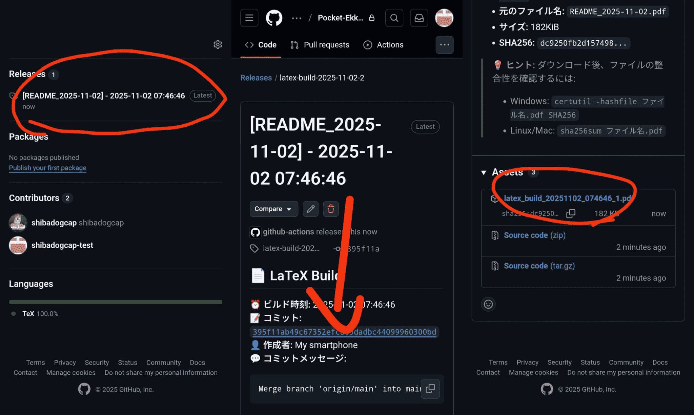

# 結果

GitHub Actionsを用いたPDF生成のワークフローが正常に動作し、Obsidianでの編集内容が反映されたPDFファイルが生成されたことを確認した。
今回の手法を用いると、マークダウンファイルを表の罫線やセクションの構成を簡単にレポートとして提出できる形式に変換できる。

# 追加情報

実行方法には書かれていないが、このVaultにはgitプラグイン以外にも複数のプラグインが導入されている。
使用しているプラグインと、機能、簡単な使い方を示す。詳しくは各プラグインのドキュメントを参照されたい。

| プラグイン名 | 機能 | 今回の用途 | 使い方・そのほかの情報 |
| --- | --- | --- | --- |
| [Obsidian Git](https://github.com/denolehov/obsidian-git) | Gitとの連携 | GitHubとのファイルのやりとりの実現 | コマンドパレットから「Git: Push」を選択することで、変更をリモートリポジトリにプッシュ可能。ショートカットキーへ割り当てることも可能。コンフリクトの解決もサポート。 |
| [Export To TeX Enhanced](https://github.com/shibadogcap/obsidian-export-to-tex-enhanced) | MarkdownからTeX形式への変換 | レポートのTeX形式へのエクスポート | コマンドパレット、リボン（デスクトップの場合）、ショートカットキーでファイルまたはクリップボードにTeXをエクスポート可能。 |
| [Templater](https://silentvoid13.github.io/Templater/) | テンプレートの利用・自動化 | ファイル作成時に自動でテンプレートを適用する | コマンドパレットを開き、「Templater: Insert Template」を選択する。 |
| [Obsidian LaTeX Suite](https://github.com/artisticat1/obsidian-latex-suite) | LaTeX数式のプレビューとスニペット | 数式入力の支援と効率化 | 設定画面からスニペットをカスタマイズ可能。 |
| [Obsidian LanguageTool](https://github.com/Clemens-E/obsidian-languagetool-plugin) | 文法チェックと校正 | スペルチェック | 設定画面からチェックのインターバルなどをカスタム可能。 |
| [Copilot](https://github.com/logancyang/obsidian-copilot) | AIによる文章校正 | 文章作成の支援 | [Google AI Studio](https://aistudio.google.com/)からAPIキーを取得して設定する必要あり。 |
| [File Explorer++](https://github.com/kelszo/obsidian-file-explorer-plus) | ファイルエクスプローラーの拡張 | テンプレート用ファイルなどを非表示にする | 非表示のほかにピン留めも可能。 |

このほか、[UNITADE.md](https://github.com/Falcion/UNITADE.md)のバンドルも検討したが、モバイルとデスクトップで設定を共有した際にクラッシュが起きたことから、導入していない。
これを導入すると、.md以外のテキストファイルをObsidian内で編集でき、.texの最終調整が必要になった場合に便利になる可能性がある。

# 考察

今回は、レポート作成の手法としてObsidianとGitHub Actionsを組み合わせた方法を提案し、実際に運用可能であることを示した。
これは、既存の様々な方法に対して以下のような利点があると考えられる。

## ローカルのTeXLiveとVSCodeを使用する場合との比較
ローカルでTeXLiveとVSCodeを使用する場合、今回の手法でも環境構築の手間はそこまで大きく変わらない。
しかし、ローカルで完結する環境構築をした場合、バージョン管理やバックアップの用意は別に自分で行う必要がある。
この点では、ObsidianとGitHub Actionsを使用することで、スマートフォンでの編集や自動バックアップ、PDF生成の自動化が可能となり、より柔軟で便利な執筆環境を提供できる点が大きな利点である。

## オンラインLaTeXエディタを使用する場合との比較
OverleafなどのオンラインLaTeXエディタを使用する場合、環境構築の手間は今回の手法よりだいぶ小さい。
しかし、オンラインエディタは安定したインターネット接続が必要であり、サービスが常に利用可能である保証がない。
また、スマートフォンで直接.texファイルを書くことが前提となるため、長文の執筆には向いていない。
一方、今回の手法では、Obsidianを使用することで、同期はできないもののオフラインでの編集が可能であり、また長文を書く際にも比較的楽である。

# まとめ
本レポジトリでは、ObsidianとGitHub Actionsを組み合わせた新しい実験レポート作成手法を提案し、実際に運用可能であることを示した。
この手法により、スマートフォンを含む様々な環境で簡単にレポートを作成できるようになり、従来の方法と異なる利便性を提供できる。

# 使用したサービスなど
- [Obsidian](https://obsidian.md/)
- [GitHub](https://github.com/)
- [GitHub Actions](https://docs.github.com/en/actions)
- [Obsidian Git (プラグイン)](https://github.com/denolehov/obsidian-git)
- [Export To TeX(プラグイン)](https://github.com/raineszm/obsidian-export-to-tex)
- [Export To TeX Enhanced (プラグイン)](https://github.com/shibadogcap/obsidian-export-to-tex-enhanced)
- [Templater (プラグイン)](https://silentvoid13.github.io/Templater/)
- [Obsidian LaTeX Suite (プラグイン)](https://github.com/artisticat1/obsidian-latex-suite)
- [Obsidian LanguageTool (プラグイン)](https://github.com/Clemens-E/obsidian-languagetool-plugin) 
- [Copilot (プラグイン)](https://github.com/logancyang/obsidian-copilot)
- [File Explorer++ (プラグイン)](https://github.com/kelszo/obsidian-file-explorer-plus)
- [actions/checkout (GitHub Action)](https://github.com/actions/checkout)
- [dorny/paths-filter (GitHub Action)](https://github.com/dorny/paths-filter)
- [xu-cheng/texlive-action (GitHub Action)](https://github.com/xu-cheng/texlive-action)
- [softprops/action-gh-release (GitHub Action)](https://github.com/softprops/action-gh-release)
- [LaTeXテンプレート](https://gitlab.mma.club.uec.ac.jp/hydrogen/latex-template)