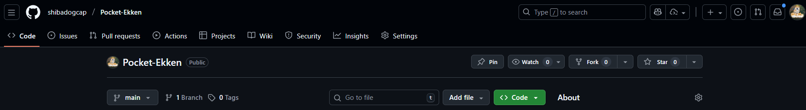

# Pocket-Ekken
# 実験の目的
## 目的
このレポジトリは、LaTeXやVSCodeなどの環境構築なしで、スマートフォンを含む環境で簡単に基礎科学実験Aで使用できる実験レポートを制作できるようにすることを目的としている。
## 背景
基礎科学実験Aで実験レポートを作成する際、VSCodeと$\LaTeX$を使用するのが一般的になっている。
しかし、これらの環境を用意するのは面倒であるし、使い勝手もよいといえない。具体的に例を挙げると

- ローカルでのLaTeXの環境構築には時間がかかり、ある程度のPCスキルが必要である。
- ローカルでの執筆を前提とすると、バックアップに不安がある。
- オンラインエディタを使用する場合、安定したインターネット接続が必要で、サービスが常に利用可能である保証がない[^1]
- 基本的に.texを編集するのはコードエディタであり、長文を書くのに向いていない。
- いずれの環境でもスマートフォンでレポートを確認したり編集したりするのは難しい。

などの問題がある。
そこで、本レポジトリでは、マークダウンエディタ[Obsidian](https://obsidian.md/)を用いて、スマートフォンを含む様々な環境で簡単に実験レポートを作成できるようにする。

# 実験の原理
背景の問題を解決するために、以下の方針を採用した。

1. ObsidianのVaultを配布することで、環境構築を不要にする。
2. スマートフォンアプリのObsidianを使用することで、スマートフォンでの編集・確認を可能にする。
3. マークダウンファイルをそのままコンパイルできる.texファイルに変換するスクリプトを提供することで、.texファイルの編集を不要にする。
4. GitHubと同期することを前提とし、バックアップを容易にするとともに、GitHub Actionsを用いて自動的にPDFを生成する。

構成のイメージは以下の図のようになる。

# 実験方法
ここでは、実際にObsidianを用いて実験レポートを作成する手順を説明する。
まず、スマートフォンまたはPCにObsidianをインストールする。Obsidianは[公式サイト](https://obsidian.md/)からダウンロードできる。
続いて、このレポジトリをダウンロードする。ブラウザで[このレポジトリ](https://github.com/shibadogcap/Pocket-Ekken)にアクセスし、緑の「Code」ボタンをクリックしてリポジトリをダウンロードする。

ダウンロードしたzipファイルを解凍し、適当な場所に保存する。

# 実験結果

# 考察

# まとめ

# 参考文献

# 付録

[^1]: 例えば、代表的なオンラインLaTeXエディタであるOverleafの[ステータスページ](https://status.overleaf.com) によれば代表的なオンラインLaTeXエディタであるOverleafは、2025年8月に3時間ほどサービスが停止したことがある。
